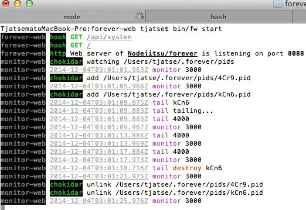
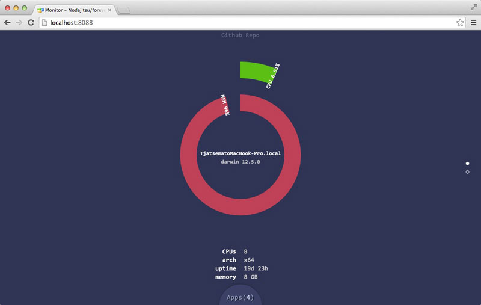
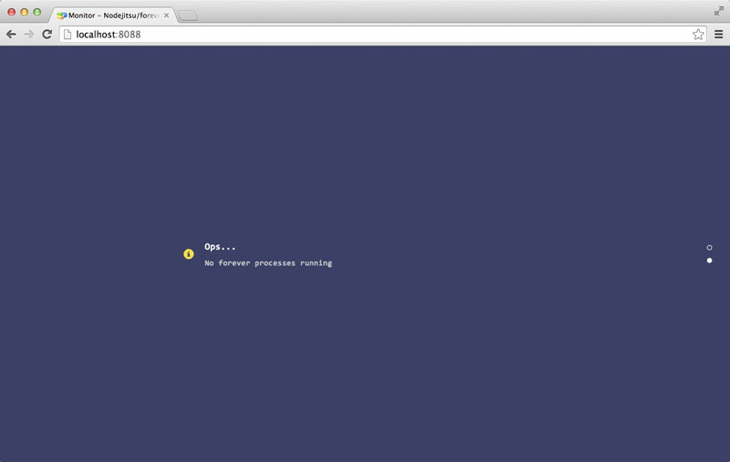
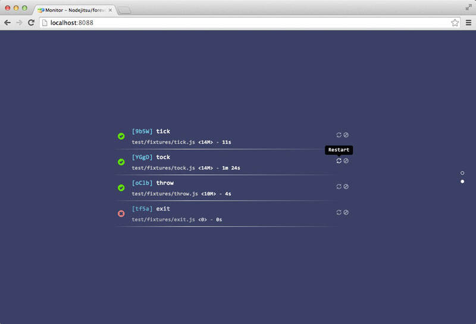
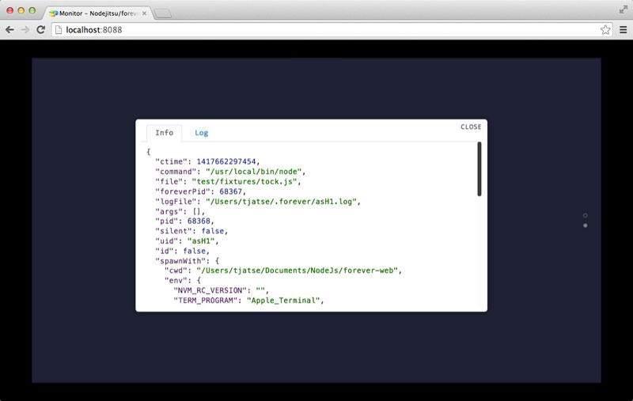
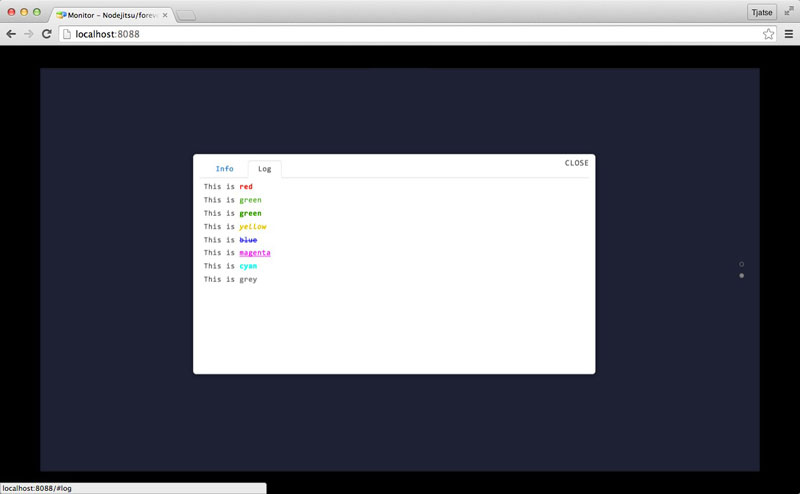

forever-web [](http://badge.fury.io/js/forever-web)
===========
An elegant web interface for Nodejitsi/forever.

# Guide
- [Installation](#ins)
- [CLI](#cli)
  - [Run Web Interface](#cli_web)
  - [Configs](#cli_confs)
    - [Set](#cli_conf_set)
    - [Remove](#cli_conf_remove)
- [Features](#feats)
- [Cautions](#cauts)
- [UI/UX](#ui)
  - [Backend](#back)
  - [Home](#home)
  - [Empty List](#no_proc)
  - [Processes](#procs)
  - [Describe Complete Information](#info)
  - [Tail Logs](#tail_logs)
- [TODO](#todo)


<a name="ins" />
# Installation
```
$ npm install -g forever-web
```

<a name="cli" />
# CLI
```bash
  Usage: fw [cmd] [file|name]

  Commands:

    start [options] [port]  Launch the web server, port default by 8088
    config                  show all configs
    set <key> <value>       set config by key-value pairs
    rm <key>                remove config by key

  Options:

    -h, --help     output usage information
    -v, --version  output the version number

  Basic Examples:

    Start the web server, by default port (8088):
    $ fw start

    Start the web server, by specific port (8090):
    $ fw start 8090

```

<a name="cli_web" />
## Run Web Interface
```bash
  Usage: start [options] [port]

  Options:

    -h, --help  output usage information
    --no-debug  hide stdout/stderr information
```

<a name="cli_confs" />
## Configs
```JSON
{
  "refresh": 3000
  "manipulation": true
  "forever": "~/.forever"
}
```

- **refresh** The heartbeat duration of monitor (backend), `5000` by default.
- **manupulation** A value indicates whether the client has permission to restart/stop processes, `true` by default.
- **forever** Root directory of nodejitsu/forever, `~/.forever` by default.

<a name="cli_conf_set">
### Set Config
Usage
```bash
$ fw set <key> <value>
```

```bash
$ fw set refresh 2000
```

Above command will set `refresh` to two second.

<a name="cli_conf_remove">
### Remove Config
Usage
```bash
$ fw rm <key>
```

```bash
$ fw rm refresh
```

Above command will remove `refresh` config and it will be set to `5000` by default.


<a name="feats" />
# Feature
- All the heartbeats - including **monitor** and **tail (logs)** are automatic destroyed.
- The `forever` processes are watched by a FSWatcher ([chokidar](https://www.npmjs.org/package/chokidar)), but not manually polling.
- Communicated with `forever` through [NSSocket](https://www.npmjs.org/package/nssocket) directly, but not `forever` programmatic API.
- Socket.io between client and server.
- Monitor CPU and Memory usage of server in a real-time.
- Monitor `forever` processes in a real-time.

<a name="cauts" />
# Cautions
- Web Interface is wrote by CSS3 && HTML5, so view it with the latest version of the browser (WebGL, Animation, WebSocket supports), e.g. Chrome, Safari and Firefox.
- I've never test it on Internet Explorer.
- I've never test it on Windows.
- Nodejitsu/forever has problem with `STOPPED` process, so if there is a `STOPPED` process, however, it can create instability, you'd better refresh the page manually (F5 / COMMAND + R).

<a name="ui" />
# UI/UX
- Amazing and smooth animations.
- High performance.

<a name="back" />
Backend (without `--no-debug` option):



<a name="home" />
Home



<a name="no_proc" />
Empty List



<a name="procs" />
Processes



<a name="info" />
Describe Complete Information



<a name="tail_logs" />
Tail Logs



<a name="todo" />
# TODO
- [ ] Implement restart/stop
- [ ] Test on Windows (need environment).
- [ ] Need feedback/test.


## License
Licensed under the Apache License, Version 2.0 (the "License");
you may not use this file except in compliance with the License.
You may obtain a copy of the License at

    http://www.apache.org/licenses/LICENSE-2.0

Unless required by applicable law or agreed to in writing, software
distributed under the License is distributed on an "AS IS" BASIS,
WITHOUT WARRANTIES OR CONDITIONS OF ANY KIND, either express or implied.
See the License for the specific language governing permissions and
limitations under the License.
